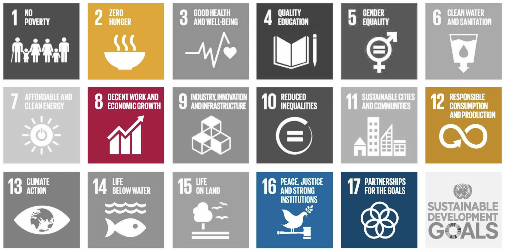

![[web3RP]](docs/header.jpg)

# web3RP

## Imagine an ERP, or Enterprise Resource Planning, without the E.

Replace the profit-oriented centralized organization for a [DAO](https://en.wikipedia.org/wiki/Decentralized_autonomous_organization) taking care of it.

web3 describes the decentralized world we will build upon for the next generations of our full-immersive digital society

Welcome to web3RP!

Forget about Microsoft / SAP / Oracle selling atrocious Dynamics / Business ByDesign / Fusion licenses for thousands of dollars per user a year.

Get a real helper to streamline your business of any size or kind as fast as a couple of clicks...

Decentralized Resource Planning application for people to nurture their work routine.

### MVP
- **Supply chain traceability**
- **Bookkeeping**
- **ESG rewards**

[Demo](https://web3rp.pages.dev/)

### Roadmap
- Inventory
- Accounting
- Human resources
- Customer relationship

## Food donation (restaurant, supermarket, catering, bakery, delicatessen, etc.)

Brazil's current sanitary and health policies made very hard for food donation and we want to use blockchain to bind to actors that now are not engaging to each other.

In our view, NGOs will provide QR codes to people facing food vulnerability, who will collect meals from previously registered donors. When the NGO issues a QR code, it receives an NFT ERC-721 and accumulates in its wallet.

Each donated meal avoids food waste, reducing the amount of solid waste. Also, and most importantly, keeps one from feeling hungry.

QR Codes will have their validation on-chain and generate ERC-20 tokens (rewards) which could be accumulated by the donors. Those tokens can be used as deductions for income taxes, with values calculated by the average of the current price of the consumer price index among foods.

NFTs accumulated by donors can be used in two ways:
1. Social recognition for being a sustainable company, in the form of collectible awards (badges);
2. Commercializing to other companies that do not have a sustainable development agenda and want to compensate for their impact.

## Skin in the game🫀with glass walls

Use case for NGOs so it's possible to better control and also give full disclosure of their ledger books.

[instagram @maniivaciente](https://www.instagram.com/maniivaciente)

Vegan, paleo and raw. DAO connecting food growers, producers and consumers bridging the gap of nutrition and quantified self data. 0% gluten, 0% sugar, 0% salt, 0% soy 0% fry.
Maniiva is a legally binding DAO that operates as a real world LLC. Using Ethereum for incorporation, governance and fundraising It is a legal entity that runs entirely on the blockchain. The owners of the company are it’s employees that receive compensation in cash and tokens representing equity in the LLC based on the amount of hours they work for it. 

All of it is managed though the employees/token holders private keys on otoco.io ‘s dashboard, which is being built by us through [doiim.com](https://doiim.com) and can be used in most kinds of organizations worldwide. From the farm to the table, all the agentes in the supply chain gets compensated as the restaurant produces vegan, paleo and raw food. DAO connecting food growers, producers and consumers bridging the gap of nutrition and quantified self data. 0% gluten, 0% sugar, 0% salt, 0% soy 0% fry.

On maniiva.com there is no pre mine and no investors holding tokens, it’s funding is initially granted by doiim.com as a donation for a social cause. Only Maniiva’s employees/contributors can be token holders, you can’t buy or trade it. You can only earn it though the effort of your work for the DAO. 

By holding it you can vote on the DAO’s decision, elect management counsel that conduct day to day operations without creating a governance overhead for every small decision, leaving only the major things to be decided by the token holders. 'Hodling' the token earn dividends from it’s operation, and in case you are in disagreement with the projects progress you can redeem your pro-rata share of the DAO’s treasury any time you want.

## Which United Nations [SDGs](https://sdgs.un.org/goals) are we engaged with?

[#2](https://sdgs.un.org/goals/goal2)  End hunger, achieve food security and improved nutrition and promote sustainable agriculture

[#8](https://sdgs.un.org/goals/goal8)  Promote sustained, inclusive and sustainable economic growth, full and productive employment and decent work for all;

[#12](https://sdgs.un.org/goals/goal12)  Ensure sustainable consumption and production patterns;

[#16](https://sdgs.un.org/goals/goal16)  Promote peaceful and inclusive societies for sustainable development, provide access to justice for all and build effective, accountable and inclusive institutions at all levels;

[#17](https://sdgs.un.org/goals/goal17)  Strengthen the means of implementation and revitalize the Global Partnership for Sustainable Development.

**Benchmarking ⤵**

https://coda.io/use-cases